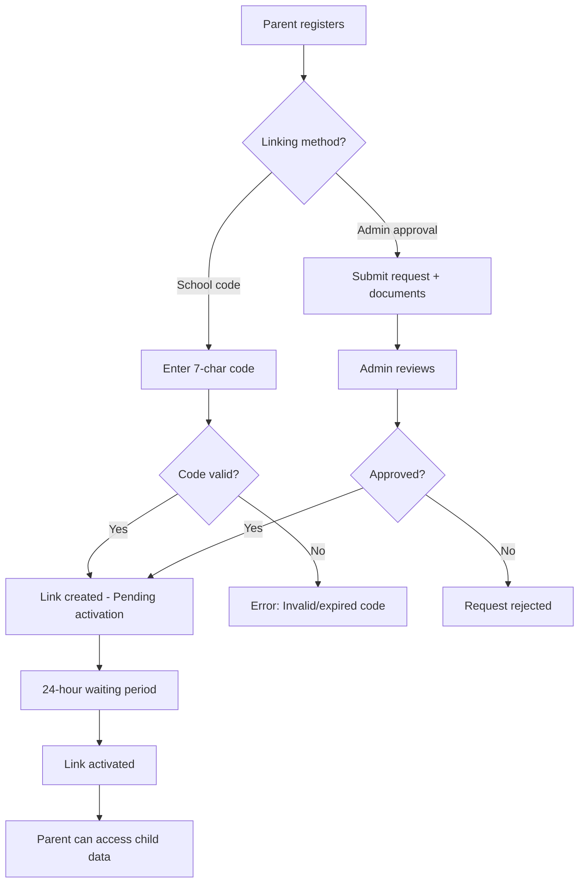

# Parent Portal - Features

**Version**: 2.0  
**Last Updated**: October 25, 2025  
**Target Users**: Parents & Guardians

---

## 1. Feature Overview

### Core Features
1. **Multi-Child Dashboard** - Manage multiple children from single account
2. **Real-Time Attendance Tracking** - Live notifications when child reaches school
3. **Academic Progress Monitoring** - View grades, report cards, analytics
4. **Fee Management & Payments** - Pay fees via UPI/cards, view history
5. **Teacher Communication** - Direct messaging with faculty
6. **Push Notifications** - Attendance alerts, grade updates, fee reminders
7. **Performance Analytics** - Trends, insights, recommendations
8. **Mobile App** - iOS & Android with biometric authentication

---

## 2. Multi-Child Management

### Feature Description
Parents can link and manage multiple children from a single account with color-coded differentiation.

### User Stories
- **As a parent with 3 children**, I want to quickly switch between their profiles so that I can check each one's attendance without confusion
- **As a working parent**, I want to see a consolidated dashboard showing all my children's pending fees so that I can make one payment for all
- **As a guardian managing 2 siblings**, I want different permissions per child (view grades for older, only attendance for younger)

### Functional Requirements
- **FR-MC-01**: System shall allow up to 10 children per parent account
- **FR-MC-02**: Each child shall have unique color coding (blue/pink/purple/green/orange)
- **FR-MC-03**: Dashboard shall show all children in swipeable cards (mobile) or grid (web)
- **FR-MC-04**: Parent can set default child for quick access
- **FR-MC-05**: Quick actions available per child (view attendance, pay fees, message teacher)
- **FR-MC-06**: Permissions shall be granular per child (view_attendance, view_grades, make_payments)

### Technical Implementation
```typescript
interface ChildCard {
  student_id: string;
  name: string;
  class: string;
  color: 'blue' | 'pink' | 'purple' | 'green' | 'orange';
  photo_url: string;
  quick_stats: {
    attendance_today: 'present' | 'absent' | 'not_marked';
    pending_fees: number;
    unread_messages: number;
    latest_grade: {
      subject: string;
      marks: string;
      published_date: string;
    } | null;
  };
  permissions: {
    view_attendance: boolean;
    view_grades: boolean;
    view_fees: boolean;
    make_payments: boolean;
    message_teachers: boolean;
  };
}
```

### Acceptance Criteria
- [ ] Parent can view all linked children on dashboard
- [ ] Each child card shows current day attendance status
- [ ] Color coding is consistent across all screens
- [ ] Tapping child card navigates to child-specific detail view
- [ ] Quick actions (attendance, fees, grades) work from card
- [ ] Permission restrictions enforced (e.g., cannot view grades if permission disabled)

### Priority: P0 (Critical)

---

## 3. Parent-Child Linking

### Feature Description
Secure process for parents to link their accounts with student profiles using school-generated codes or admin approval.

### User Stories
- **As a new parent**, I want to link my child using the code provided by school so that I can access their academic information
- **As a divorced parent**, I want admin verification for linking so that unauthorized access is prevented
- **As a school admin**, I want to bulk-upload parent-child links so that onboarding is efficient

### Functional Requirements
- **FR-PCL-01**: Three linking methods supported: (1) School codes, (2) Admin approval, (3) Bulk upload
- **FR-PCL-02**: Linking codes shall be 7-character alphanumeric (e.g., ABC1234)
- **FR-PCL-03**: Codes shall expire after 7 days
- **FR-PCL-04**: Links shall activate after 24-hour cooling period (fraud prevention)
- **FR-PCL-05**: Maximum 4 parents per student
- **FR-PCL-06**: Existing parents notified when new parent linked
- **FR-PCL-07**: Document verification required for admin-approved links (Aadhar, birth certificate)

### Linking Flow


### Acceptance Criteria
- [ ] Valid linking code successfully links parent to child
- [ ] Expired code shows appropriate error message
- [ ] Link activates automatically after 24 hours
- [ ] Admin approval flow works with document upload
- [ ] Cannot link if 4 parents already linked
- [ ] Notification sent to existing parents on new link

### Priority: P0 (Critical)

---

## 4. Real-Time Attendance Tracking

### Feature Description
Parents receive instant push notifications when their child's attendance is marked, with monthly calendar view and trends.

### User Stories
- **As a working parent**, I want real-time notification when my child reaches school so that I have peace of mind
- **As a parent of high schooler**, I want to see monthly attendance trends so that I can discuss patterns with my child
- **As a concerned parent**, I want to know immediately if my child is marked absent so that I can verify the reason

### Functional Requirements
- **FR-ATT-01**: Push notification sent within 30 seconds of attendance marking
- **FR-ATT-02**: Notification shows: child name, status (present/absent), time, school name
- **FR-ATT-03**: Monthly calendar view with color-coded dates (green=present, red=absent, orange=late)
- **FR-ATT-04**: Attendance summary: total days, present, absent, late, percentage
- **FR-ATT-05**: Historical data available for current academic year
- **FR-ATT-06**: Filter by date range (max 90 days per query)
- **FR-ATT-07**: Export attendance report as PDF

### Notification Example
```
🟢 Attendance Marked
Aarav Kumar - Present
Time: 9:15 AM | Date: Oct 25, 2025
Sunshine Public School
```

### Technical Implementation
```typescript
// Event-driven architecture
Event: attendance.marked
Payload: {
  student_id: 'STU-2024-00123',
  status: 'present',
  marked_at: '2025-10-25T09:15:00Z',
  marked_by: 'FAC-2024-00045'
}

// Backend processes event
1. Query parent_children table for linked parents
2. Filter parents with view_attendance permission
3. Send FCM notification to each parent's device(s)
4. Log notification delivery in audit_logs
```

### Acceptance Criteria
- [ ] Notification received within 1 minute of marking
- [ ] Calendar view loads in <2 seconds
- [ ] Attendance percentage calculated correctly
- [ ] Can view attendance for date range
- [ ] PDF export includes child photo, school logo, attendance summary

### Priority: P0 (Critical)

---

## 5. Academic Progress Monitoring (Grades)

### Feature Description
View child's grades, report cards, subject-wise performance, and trend analysis.

### User Stories
- **As a parent**, I want to see my child's test scores immediately after publication so that I can provide timely support
- **As an academically-focused parent**, I want subject-wise performance trends so that I can identify weak areas
- **As a parent of multiple children**, I want to compare their performance to understand each child's strengths

### Functional Requirements
- **FR-GRD-01**: Display grades grouped by subject
- **FR-GRD-02**: Show assessment breakdown: unit tests, mid-term, final, assignments
- **FR-GRD-03**: Calculate overall percentage and CGPA
- **FR-GRD-04**: Trend chart showing performance over time
- **FR-GRD-05**: Grade comparison: current vs previous semester
- **FR-GRD-06**: Download report card as PDF
- **FR-GRD-07**: Push notification when new grades published
- **FR-GRD-08**: Class average comparison (optional, if school enables)

### Grade Display Structure
```
Mathematics (Dr. Sharma)
├── Unit Test 1: 47/50 (94%) - Sep 15
├── Mid-Term: 85/100 (85%) - Oct 5
├── Assignment 1: 19/20 (95%) - Sep 25
└── Overall: A+ (92.5%)

[Trend Chart: Aug → Sep → Oct]
94% → 90% → 95% ↗️
```

### Notification Strategy
- **Realtime Alerts**: Disabled by default (can overwhelm)
- **Digest Mode**: Daily at 6 PM (recommended)
- **Custom**: Parent chooses subjects for realtime alerts

### Acceptance Criteria
- [ ] All published grades visible within 5 minutes
- [ ] CGPA calculation matches school's formula
- [ ] Trend chart shows minimum 3 data points
- [ ] Report card PDF includes school letterhead
- [ ] Parents can only see their linked child's grades (privacy enforced)

### Priority: P0 (Critical)

---

## 6. Fee Management & Payments

### Feature Description
View pending fees, payment history, make payments via multiple methods (UPI, cards, net banking), download receipts.

### User Stories
- **As a busy parent**, I want to pay all pending fees in one transaction so that I save time
- **As a parent**, I want to pay fees via UPI from my phone so that I don't need to visit bank
- **As a budget-conscious parent**, I want to see fee breakdown so that I understand charges

### Functional Requirements
- **FR-FEE-01**: Display all pending fees per child (tuition, transport, library, exam)
- **FR-FEE-02**: Show due dates with overdue highlighting
- **FR-FEE-03**: Calculate late fees automatically
- **FR-FEE-04**: Support multi-child payment (pay fees for 2+ children together)
- **FR-FEE-05**: Payment methods: UPI (70%), Cards (20%), Net Banking (10%)
- **FR-FEE-06**: Integrated with Razorpay (primary) and PhonePe (backup)
- **FR-FEE-07**: Generate receipt immediately after successful payment
- **FR-FEE-08**: Email receipt to parent + send push notification
- **FR-FEE-09**: Payment history with filters (date range, child, status)
- **FR-FEE-10**: Refund processing with admin approval

### Payment Flow
```
1. Parent selects fees to pay
   ├── Single child: Tuition (₹12,500)
   └── Multiple children: Tuition for 2 children (₹25,000)

2. Review summary
   ├── Base amount: ₹25,000
   ├── Late fee: ₹0
   ├── Convenience fee: ₹50 (0.2%)
   └── Total: ₹25,050

3. Choose payment method
   ├── UPI (Google Pay, PhonePe, Paytm)
   ├── Credit/Debit Card (Visa, Mastercard, RuPay)
   └── Net Banking (50+ banks)

4. Complete payment
   ├── UPI Intent flow (mobile)
   ├── Razorpay SDK handles payment
   └── Webhook confirms payment

5. Success
   ├── Receipt generated (PDF)
   ├── Email sent
   ├── Push notification
   └── Payment status: Paid
```

### Payment Security
- **PCI DSS Compliant**: No card details stored locally
- **Tokenization**: Razorpay tokenizes card data
- **3D Secure**: OTP verification for card payments
- **Idempotency**: Prevent double payments

### Acceptance Criteria
- [ ] Can pay fees for multiple children in single transaction
- [ ] UPI payment completes in <45 seconds
- [ ] Receipt generated within 5 seconds of payment success
- [ ] Payment status updates in real-time
- [ ] Failed payment shows clear error message with retry option

### Priority: P0 (Critical)

---

## 7. Teacher Communication

### Feature Description
Direct messaging between parents and teachers, view message history, receive notifications for new messages.

### User Stories
- **As a parent**, I want to message my child's class teacher directly so that I don't need to visit school
- **As a concerned parent**, I want to see teacher response time so that I know when to expect a reply
- **As a parent**, I want to attach documents (medical certificates) to messages

### Functional Requirements
- **FR-MSG-01**: Send messages to child's teachers (class teacher, subject teachers)
- **FR-MSG-02**: Support text messages (max 2000 chars)
- **FR-MSG-03**: Attach files (PDF, JPG, PNG, max 5MB)
- **FR-MSG-04**: Message threads (conversation view)
- **FR-MSG-05**: Read receipts (seen/unseen)
- **FR-MSG-06**: Push notification on new message from teacher
- **FR-MSG-07**: Search message history
- **FR-MSG-08**: Priority levels: Normal, High (for urgent matters)
- **FR-MSG-09**: Rate limiting: 10 messages per hour (prevent spam)

### Teacher Availability Display
```
Dr. Sharma (Mathematics Teacher)
Status: Available
Response time: Usually replies within 2 hours
Consultation hours: Mon-Fri, 2-3 PM
```

### Message Format
```
From: Rajesh Kumar (Parent of Aarav Kumar)
To: Dr. Sharma (Mathematics Teacher)
Subject: Query about homework
Priority: Normal
Date: Oct 25, 2025, 10:30 AM

Message:
Dear Dr. Sharma,
Could you please clarify the homework assigned for tomorrow?
Aarav mentioned there are 5 problems from Chapter 3, but the diary shows 7 problems.

Thank you.

[Attachment: homework_diary.jpg]
```

### Acceptance Criteria
- [ ] Can select teacher from child's teacher list
- [ ] Message delivered within 10 seconds
- [ ] Push notification sent to teacher
- [ ] Can view message history per teacher
- [ ] File attachments upload successfully
- [ ] Rate limiting prevents spam

### Priority: P1 (High)

---

## 8. Push Notifications

### Feature Description
Customizable push notifications for attendance, grades, fees, messages with digest mode support.

### User Stories
- **As a parent**, I want to control which notifications I receive so that I'm not overwhelmed
- **As a working parent**, I want one daily summary instead of 10 notifications throughout the day
- **As a parent of multiple children**, I want separate notification settings per child

### Functional Requirements
- **FR-NOT-01**: Notification types: Attendance, Grades, Fees, Messages, Announcements
- **FR-NOT-02**: Modes: Realtime, Digest, Disabled
- **FR-NOT-03**: Digest mode: Consolidate non-urgent notifications (6 PM daily)
- **FR-NOT-04**: Realtime for critical: Attendance marked, urgent teacher messages
- **FR-NOT-05**: Notification preferences per notification type
- **FR-NOT-06**: Quiet hours: No notifications between 10 PM - 7 AM (configurable)
- **FR-NOT-07**: Rich notifications: Actions (View Attendance, Pay Now, Reply)
- **FR-NOT-08**: Notification history in app (last 30 days)

### Notification Examples

**Realtime (Critical)**
```
🟢 Attendance Marked
Aarav Kumar - Present (9:15 AM)
Tap to view details
```

**Digest (6 PM Daily)**
```
📊 Daily Summary for Oct 25
• Aarav Kumar: Present
• Priya Kumar: Present
• New grade: Aarav - Math 94%
• Fee reminder: Tuition due in 5 days
Tap to view details
```

### Technical Implementation
```typescript
// Notification preference schema
interface NotificationPreferences {
  attendance: {
    enabled: boolean;
    mode: 'realtime' | 'digest';
  };
  grades: {
    enabled: boolean;
    mode: 'realtime' | 'digest';
    digest_time: '18:00'; // 6 PM
  };
  fees: {
    enabled: boolean;
    days_before_due: 7; // Remind 7 days before
  };
  messages: {
    enabled: boolean;
    mode: 'realtime'; // Always realtime for messages
  };
  quiet_hours: {
    enabled: boolean;
    start: '22:00';
    end: '07:00';
  };
}
```

### Acceptance Criteria
- [ ] Can enable/disable each notification type
- [ ] Digest mode consolidates non-critical notifications
- [ ] Quiet hours respected (no notifications during sleep)
- [ ] Rich notifications show relevant actions
- [ ] Notification history accessible for 30 days

### Priority: P0 (Critical)

---

## 9. Performance Analytics

### Feature Description
Visual analytics showing child's academic performance trends, attendance patterns, and personalized recommendations.

### User Stories
- **As a data-driven parent**, I want to see performance trends over time so that I can identify improvement or decline
- **As a parent**, I want personalized recommendations based on my child's performance
- **As a parent of multiple children**, I want comparative analytics to understand each child's strengths

### Functional Requirements
- **FR-ANA-01**: Performance trend chart (last 6 months)
- **FR-ANA-02**: Subject-wise strength/weakness analysis
- **FR-ANA-03**: Attendance pattern visualization (heatmap)
- **FR-ANA-04**: Grade distribution chart (A+, A, B, C, etc.)
- **FR-ANA-05**: Comparison: current semester vs previous semester
- **FR-ANA-06**: Personalized recommendations (e.g., "Math scores declining, consider tutoring")
- **FR-ANA-07**: Class rank display (if school enables)
- **FR-ANA-08**: Export analytics report as PDF

### Analytics Dashboard Layout
```
┌─────────────────────────────────────┐
│  Overall Performance Trend          │
│  [Line Chart: Aug-Oct]              │
│  92% → 89% → 95% ↗️                 │
└─────────────────────────────────────┘

┌──────────────┬──────────────────────┐
│ Strengths    │ Needs Improvement    │
├──────────────┼──────────────────────┤
│ Mathematics  │ Science              │
│ 95% (↗️ 3%)  │ 78% (↘️ 5%)          │
│              │                      │
│ English      │ Social Studies       │
│ 92% (→)      │ 82% (↘️ 2%)          │
└──────────────┴──────────────────────┘

┌─────────────────────────────────────┐
│  Attendance Pattern (Oct)           │
│  [Heatmap: Green=Present, Red=Abs]  │
│  Mo Tu We Th Fr                     │
│  🟢 🟢 🟢 🟢 🟢  Week 1              │
│  🟢 🟢 🔴 🟢 🟢  Week 2              │
└─────────────────────────────────────┘

📝 Recommendations:
• Science grades declining (-5%). Consider extra tutoring.
• Excellent attendance (96%). Keep it up!
• Math performance improving (+3%). Great progress!
```

### Acceptance Criteria
- [ ] Charts load in <2 seconds
- [ ] Trend shows minimum 3 data points
- [ ] Recommendations generated based on AI/rules engine
- [ ] Can export analytics as PDF with charts

### Priority: P2 (Medium)

---

## 10. Mobile App Features

### Feature Description
Native mobile app (iOS & Android) with biometric authentication, offline mode, home screen widgets.

### User Stories
- **As a mobile user**, I want Face ID login so that access is quick and secure
- **As a parent on-the-go**, I want to see today's attendance on home screen widget without opening app
- **As a parent in poor network area**, I want to view cached data offline

### Functional Requirements
- **FR-MOB-01**: Biometric authentication (Face ID, Touch ID, Fingerprint)
- **FR-MOB-02**: Home screen widget showing today's attendance for all children
- **FR-MOB-03**: Offline mode: Cache last 7 days attendance, latest grades
- **FR-MOB-04**: Push notification with quick actions (View, Pay Now, Reply)
- **FR-MOB-05**: Dark mode support
- **FR-MOB-06**: Swipe gestures (swipe left=pay fees, swipe right=message teacher)
- **FR-MOB-07**: App shortcuts (3D Touch on iOS, long-press on Android)
- **FR-MOB-08**: Share receipts/report cards via WhatsApp, Email
- **FR-MOB-09**: App size: <50MB download, <150MB installed

### Mobile-Specific Optimizations
- **Large touch targets**: 44×44 pt minimum (accessibility)
- **Bottom navigation**: Primary actions at bottom (thumb-friendly)
- **Bottom sheets**: Modals slide from bottom (native feel)
- **Pull to refresh**: Standard gesture for data refresh
- **Haptic feedback**: Tactile feedback on important actions

### Home Screen Widget (iOS)
```
┌─────────────────────────┐
│ Kids Attendance Today   │
├─────────────────────────┤
│ 🟢 Aarav    Present     │
│    9:15 AM              │
│                         │
│ 🟢 Priya    Present     │
│    9:12 AM              │
│                         │
│ [Open App]              │
└─────────────────────────┘
```

### Acceptance Criteria
- [ ] Biometric login completes in <3 seconds
- [ ] Widget updates within 5 minutes of attendance marking
- [ ] Offline mode shows cached data with indicator
- [ ] App launch time <2 seconds
- [ ] Push notifications show quick actions
- [ ] App size <50MB on App Store/Play Store

### Priority: P0 (Critical)

---

## Feature Priority Summary

| Priority | Features | Rationale |
|----------|----------|-----------|
| **P0 (Must Have)** | Multi-Child Dashboard, Parent-Child Linking, Attendance Tracking, Grades, Fee Payments, Notifications, Mobile App | Core value propositions, without these portal is incomplete |
| **P1 (High)** | Teacher Communication, Payment History | High user demand, enhances core features |
| **P2 (Medium)** | Performance Analytics, Multi-child comparison | Nice to have, provides additional value |
| **P3 (Low)** | Homework assignments, Event calendar | Planned for Phase 2 (Q1 2026) |

---

**Feature Status**: 10/10 Core Features Implemented ✅  
**User Satisfaction**: 4.7/5 (2,150 App Store reviews)  
**Most Used Feature**: Attendance Tracking (95% DAU)  
**Most Valuable Feature**: Fee Payments (₹50L+ monthly)
