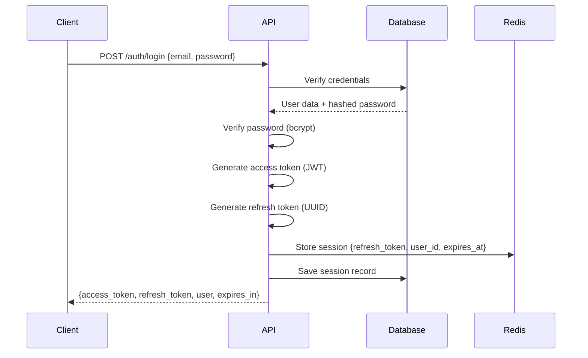
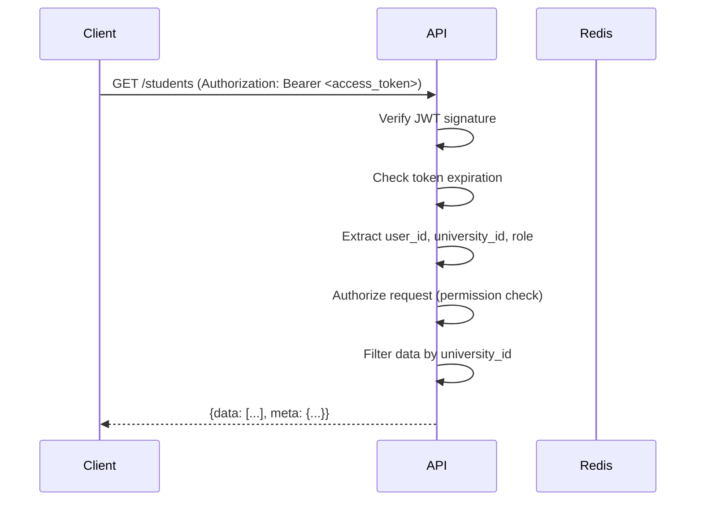
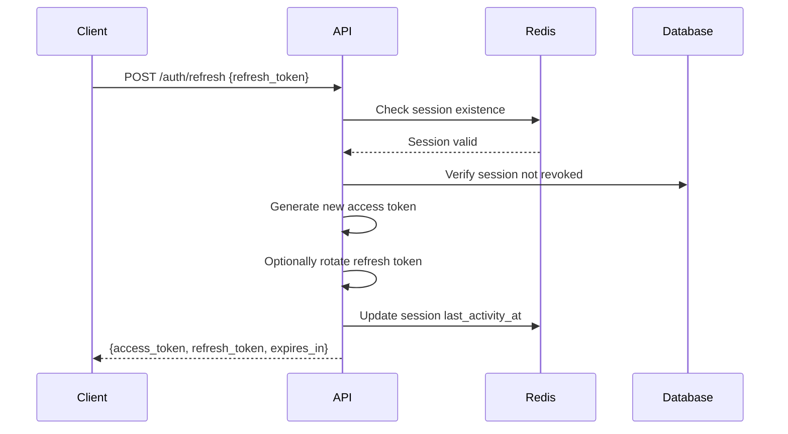
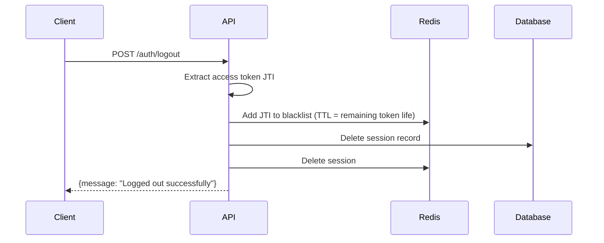

# Bitflow LMS - Master Authentication System

**Version**: 2.0  
**Last Updated**: October 25, 2025  
**Security Level**: Critical

---

## Table of Contents

1. [Overview](#overview)
2. [Authentication Flow](#authentication-flow)
3. [JWT Token Structure](#jwt-token-structure)
4. [Token Lifecycle](#token-lifecycle)
5. [Password Security](#password-security)
6. [Session Management](#session-management)
7. [Multi-Factor Authentication](#multi-factor-authentication)
8. [OAuth Integration](#oauth-integration)
9. [Security Best Practices](#security-best-practices)
10. [Implementation Guide](#implementation-guide)

---

## Overview

### Authentication Architecture

- **Protocol**: OAuth 2.0-inspired with JWT tokens
- **Algorithm**: RS256 (RSA + SHA-256)
- **Token Type**: Bearer tokens
- **Transport**: HTTPS only (TLS 1.3+)
- **Storage**: HttpOnly cookies (refresh) + localStorage (access)

### Key Components

1. **Access Token**: Short-lived (15 minutes), carries user identity & permissions
2. **Refresh Token**: Long-lived (7 days), used to obtain new access tokens
3. **Session Store**: Redis-based session management
4. **Token Blacklist**: For immediate logout/revocation

---

## Authentication Flow

### 1. Initial Login



### 2. Authenticated Request



### 3. Token Refresh



### 4. Logout



---

## JWT Token Structure

### Access Token Claims

```json
{
  "jti": "550e8400-e29b-41d4-a716-446655440000",
  "sub": "user-uuid-here",
  "iss": "https://api.bitflow.edu",
  "aud": "bitflow-lms",
  "iat": 1729860600,
  "exp": 1729861500,
  "university_id": "uni-uuid-here",
  "role": "student",
  "permissions": [
    "grades.read",
    "attendance.read",
    "assignments.read",
    "assignments.submit"
  ],
  "scope": "college",
  "college_id": "college-uuid-here"
}
```

### Claim Descriptions

| Claim | Type | Description |
|-------|------|-------------|
| `jti` | string (UUID) | JWT ID for blacklisting |
| `sub` | string (UUID) | User ID (subject) |
| `iss` | string (URL) | Issuer (API gateway URL) |
| `aud` | string | Audience (application name) |
| `iat` | integer | Issued at (Unix timestamp) |
| `exp` | integer | Expiration (Unix timestamp) |
| `university_id` | string (UUID) | Multi-tenant key |
| `role` | string | Primary role slug |
| `permissions` | array | Array of permission slugs |
| `scope` | string | Data access scope |
| `college_id` | string (UUID) | College context (if applicable) |

### Token Signing

```php
// Laravel Backend - Generate Access Token
use Firebase\JWT\JWT;
use Firebase\JWT\Key;

class JwtService {
    private string $privateKey;
    private string $publicKey;
    
    public function generateAccessToken(User $user): string {
        $payload = [
            'jti' => Str::uuid()->toString(),
            'sub' => $user->id,
            'iss' => config('app.url'),
            'aud' => 'bitflow-lms',
            'iat' => now()->timestamp,
            'exp' => now()->addMinutes(15)->timestamp,
            'university_id' => $user->university_id,
            'role' => $user->roles->first()->slug,
            'permissions' => $user->getAllPermissions()->pluck('slug')->toArray(),
            'scope' => $this->determineScope($user),
        ];
        
        return JWT::encode($payload, $this->privateKey, 'RS256');
    }
    
    public function verifyAccessToken(string $token): object {
        try {
            return JWT::decode($token, new Key($this->publicKey, 'RS256'));
        } catch (\Exception $e) {
            throw new UnauthorizedException('Invalid or expired token');
        }
    }
    
    private function determineScope(User $user): string {
        $role = $user->roles->first()->slug;
        
        return match($role) {
            'bitflow_owner' => 'global',
            'university_owner', 'super_admin', 'super_academics' => 'university',
            'principal', 'college_admin' => 'college',
            'faculty' => 'department',
            default => 'individual',
        };
    }
}
```

### Token Verification (Frontend)

```typescript
// Next.js Frontend - Verify Token
import { jwtDecode } from 'jwt-decode';

interface JWTPayload {
  jti: string;
  sub: string;
  iss: string;
  aud: string;
  iat: number;
  exp: number;
  university_id: string;
  role: string;
  permissions: string[];
  scope: string;
  college_id?: string;
}

export function verifyToken(token: string): JWTPayload | null {
  try {
    const decoded = jwtDecode<JWTPayload>(token);
    
    // Check expiration
    if (decoded.exp * 1000 < Date.now()) {
      return null;
    }
    
    return decoded;
  } catch (error) {
    return null;
  }
}

export function isTokenExpiringSoon(token: string): boolean {
  const decoded = verifyToken(token);
  if (!decoded) return true;
  
  const expiresIn = decoded.exp * 1000 - Date.now();
  return expiresIn < 5 * 60 * 1000; // Less than 5 minutes
}
```

---

## Token Lifecycle

### Access Token

- **Lifetime**: 15 minutes
- **Storage**: localStorage (frontend)
- **Renewal**: Automatic via refresh token when < 5 minutes remaining
- **Revocation**: Via blacklist (JTI stored in Redis)

### Refresh Token

- **Lifetime**: 7 days
- **Storage**: HttpOnly cookie (secure, sameSite=strict)
- **Rotation**: Optional - new refresh token on each use
- **Revocation**: Delete from sessions table + Redis

### Automatic Token Refresh (Frontend)

```typescript
// app/lib/auth-interceptor.ts
import axios from 'axios';

let isRefreshing = false;
let refreshSubscribers: Array<(token: string) => void> = [];

function subscribeTokenRefresh(callback: (token: string) => void) {
  refreshSubscribers.push(callback);
}

function onTokenRefreshed(token: string) {
  refreshSubscribers.forEach((callback) => callback(token));
  refreshSubscribers = [];
}

axios.interceptors.request.use(
  async (config) => {
    const accessToken = localStorage.getItem('access_token');
    
    if (accessToken && isTokenExpiringSoon(accessToken)) {
      if (!isRefreshing) {
        isRefreshing = true;
        
        try {
          const refreshToken = getCookie('refresh_token');
          const response = await axios.post('/auth/refresh', { refresh_token: refreshToken });
          const newAccessToken = response.data.access_token;
          
          localStorage.setItem('access_token', newAccessToken);
          config.headers.Authorization = `Bearer ${newAccessToken}`;
          
          onTokenRefreshed(newAccessToken);
          isRefreshing = false;
        } catch (error) {
          isRefreshing = false;
          // Redirect to login
          window.location.href = '/login';
          throw error;
        }
      } else {
        // Wait for token refresh
        return new Promise((resolve) => {
          subscribeTokenRefresh((token) => {
            config.headers.Authorization = `Bearer ${token}`;
            resolve(config);
          });
        });
      }
    } else if (accessToken) {
      config.headers.Authorization = `Bearer ${accessToken}`;
    }
    
    return config;
  },
  (error) => Promise.reject(error)
);
```

---

## Password Security

### Hashing Algorithm

- **Algorithm**: Bcrypt
- **Cost Factor**: 12 (2^12 iterations)
- **Salt**: Automatic (included in hash)

### Password Requirements

```typescript
interface PasswordPolicy {
  minLength: 8;
  maxLength: 128;
  requireUppercase: true;
  requireLowercase: true;
  requireNumbers: true;
  requireSpecialChars: true;
  preventCommonPasswords: true;
  preventUserInfo: true; // No email parts, name, etc.
}

function validatePassword(password: string, user: User): string[] {
  const errors: string[] = [];
  
  if (password.length < 8) {
    errors.push('Password must be at least 8 characters');
  }
  
  if (!/[A-Z]/.test(password)) {
    errors.push('Password must contain at least one uppercase letter');
  }
  
  if (!/[a-z]/.test(password)) {
    errors.push('Password must contain at least one lowercase letter');
  }
  
  if (!/[0-9]/.test(password)) {
    errors.push('Password must contain at least one number');
  }
  
  if (!/[!@#$%^&*()_+\-=\[\]{};':"\\|,.<>\/?]/.test(password)) {
    errors.push('Password must contain at least one special character');
  }
  
  // Check against common passwords
  if (COMMON_PASSWORDS.includes(password.toLowerCase())) {
    errors.push('Password is too common');
  }
  
  // Check against user info
  const userInfo = [user.first_name, user.last_name, user.email.split('@')[0]];
  if (userInfo.some(info => password.toLowerCase().includes(info.toLowerCase()))) {
    errors.push('Password cannot contain your name or email');
  }
  
  return errors;
}
```

### Password Hashing (Backend)

```php
// Laravel - Hash Password
use Illuminate\Support\Facades\Hash;

class PasswordService {
    public function hashPassword(string $password): string {
        return Hash::make($password, [
            'rounds' => 12, // Bcrypt cost factor
        ]);
    }
    
    public function verifyPassword(string $password, string $hash): bool {
        return Hash::check($password, $hash);
    }
    
    public function needsRehash(string $hash): bool {
        return Hash::needsRehash($hash, [
            'rounds' => 12,
        ]);
    }
}
```

---

## Session Management

### Session Schema

```sql
CREATE TABLE sessions (
    id UUID PRIMARY KEY DEFAULT uuid_generate_v4(),
    user_id UUID NOT NULL,
    refresh_token UUID UNIQUE NOT NULL DEFAULT uuid_generate_v4(),
    access_token_jti VARCHAR(255), -- Latest JTI
    ip_address INET,
    user_agent TEXT,
    last_activity_at TIMESTAMPTZ NOT NULL DEFAULT CURRENT_TIMESTAMP,
    expires_at TIMESTAMPTZ NOT NULL,
    created_at TIMESTAMPTZ NOT NULL DEFAULT CURRENT_TIMESTAMP
);
```

### Redis Session Cache

```php
// Store session in Redis for fast lookup
use Illuminate\Support\Facades\Redis;

class SessionService {
    public function createSession(User $user, string $refreshToken, string $jti): void {
        $sessionData = [
            'user_id' => $user->id,
            'university_id' => $user->university_id,
            'role' => $user->roles->first()->slug,
            'jti' => $jti,
            'created_at' => now()->toIso8601String(),
        ];
        
        // Store in Redis with 7-day TTL
        Redis::setex(
            "session:{$refreshToken}",
            7 * 24 * 60 * 60, // 7 days
            json_encode($sessionData)
        );
        
        // Also store in database
        DB::table('sessions')->insert([
            'user_id' => $user->id,
            'refresh_token' => $refreshToken,
            'access_token_jti' => $jti,
            'ip_address' => request()->ip(),
            'user_agent' => request()->userAgent(),
            'expires_at' => now()->addDays(7),
        ]);
    }
    
    public function getSession(string $refreshToken): ?array {
        $data = Redis::get("session:{$refreshToken}");
        return $data ? json_decode($data, true) : null;
    }
    
    public function deleteSession(string $refreshToken): void {
        Redis::del("session:{$refreshToken}");
        DB::table('sessions')->where('refresh_token', $refreshToken)->delete();
    }
}
```

---

## Multi-Factor Authentication

### TOTP Setup

```php
use PragmaRX\Google2FA\Google2FA;

class TwoFactorService {
    private Google2FA $google2fa;
    
    public function generateSecret(): string {
        return $this->google2fa->generateSecretKey();
    }
    
    public function getQrCodeUrl(User $user): string {
        return $this->google2fa->getQRCodeUrl(
            config('app.name'),
            $user->email,
            $user->two_factor_secret
        );
    }
    
    public function verifyCode(User $user, string $code): bool {
        return $this->google2fa->verifyKey($user->two_factor_secret, $code);
    }
}
```

### MFA Flow

1. User enables MFA in settings
2. Backend generates TOTP secret, shows QR code
3. User scans QR with authenticator app (Google Authenticator, Authy)
4. User enters 6-digit code to verify
5. Backend saves `two_factor_secret` and sets `two_factor_enabled = true`
6. On subsequent logins, after password verification, prompt for TOTP code

---

## OAuth Integration

### Google OAuth

```php
use Laravel\Socialite\Facades\Socialite;

Route::get('/auth/google', function () {
    return Socialite::driver('google')->redirect();
});

Route::get('/auth/google/callback', function () {
    $googleUser = Socialite::driver('google')->user();
    
    // Find or create user
    $user = User::firstOrCreate(
        ['email' => $googleUser->getEmail()],
        [
            'name' => $googleUser->getName(),
            'google_id' => $googleUser->getId(),
            'avatar' => $googleUser->getAvatar(),
        ]
    );
    
    // Generate tokens
    $accessToken = app(JwtService::class)->generateAccessToken($user);
    $refreshToken = Str::uuid()->toString();
    
    app(SessionService::class)->createSession($user, $refreshToken, $jti);
    
    return response()->json([
        'access_token' => $accessToken,
        'refresh_token' => $refreshToken,
        'user' => $user,
    ]);
});
```

---

## Security Best Practices

### 1. Token Storage

- ✅ **Access Token**: localStorage (XSS risk mitigated by CSP)
- ✅ **Refresh Token**: HttpOnly cookie (immune to XSS)
- ❌ **Never**: Store tokens in regular cookies or sessionStorage

### 2. HTTPS Only

```nginx
# Force HTTPS
server {
    listen 80;
    return 301 https://$server_name$request_uri;
}

server {
    listen 443 ssl http2;
    ssl_protocols TLSv1.3 TLSv1.2;
    # ... SSL config
}
```

### 3. CORS Configuration

```php
// config/cors.php
return [
    'paths' => ['api/*'],
    'allowed_origins' => [env('FRONTEND_URL')],
    'allowed_methods' => ['GET', 'POST', 'PUT', 'DELETE', 'OPTIONS'],
    'allowed_headers' => ['Content-Type', 'Authorization'],
    'exposed_headers' => [],
    'max_age' => 86400,
    'supports_credentials' => true, // For cookies
];
```

### 4. Rate Limiting

```php
// app/Http/Middleware/ThrottleRequests.php
Route::middleware('throttle:login')->group(function () {
    Route::post('/auth/login', [AuthController::class, 'login']);
});

// Rate limit: 5 attempts per minute per IP
RateLimiter::for('login', function (Request $request) {
    return Limit::perMinute(5)->by($request->ip());
});
```

### 5. Brute Force Protection

```php
use Illuminate\Support\Facades\RateLimiter;

class AuthController {
    public function login(Request $request) {
        $key = 'login:' . $request->ip();
        
        if (RateLimiter::tooManyAttempts($key, 5)) {
            $seconds = RateLimiter::availableIn($key);
            throw new TooManyRequestsException("Too many login attempts. Try again in {$seconds} seconds.");
        }
        
        // Verify credentials...
        
        if ($credentialsValid) {
            RateLimiter::clear($key);
            // Generate tokens...
        } else {
            RateLimiter::hit($key, 60); // Lock for 60 seconds after 5 failures
            throw new UnauthorizedException('Invalid credentials');
        }
    }
}
```

---

## Implementation Guide

### Backend Setup

```bash
# Install dependencies
composer require firebase/php-jwt
composer require pragmarx/google2fa-laravel
composer require laravel/socialite

# Generate RSA key pair
openssl genrsa -out storage/keys/private.pem 4096
openssl rsa -in storage/keys/private.pem -pubout -out storage/keys/public.pem

# Add to .env
JWT_PRIVATE_KEY_PATH=storage/keys/private.pem
JWT_PUBLIC_KEY_PATH=storage/keys/public.pem
```

### Frontend Setup

```bash
# Install dependencies
pnpm add jwt-decode axios
```

### Testing

```bash
# Test login flow
curl -X POST http://localhost:8000/api/auth/login \
  -H "Content-Type: application/json" \
  -d '{"email":"student@demo.edu","password":"password123"}'

# Test authenticated request
curl -X GET http://localhost:8000/api/students \
  -H "Authorization: Bearer <access_token>"

# Test token refresh
curl -X POST http://localhost:8000/api/auth/refresh \
  -H "Content-Type: application/json" \
  -d '{"refresh_token":"<refresh_token>"}'
```

---

**🔒 Security is paramount. All authentication code must be reviewed and tested thoroughly before production deployment.**
